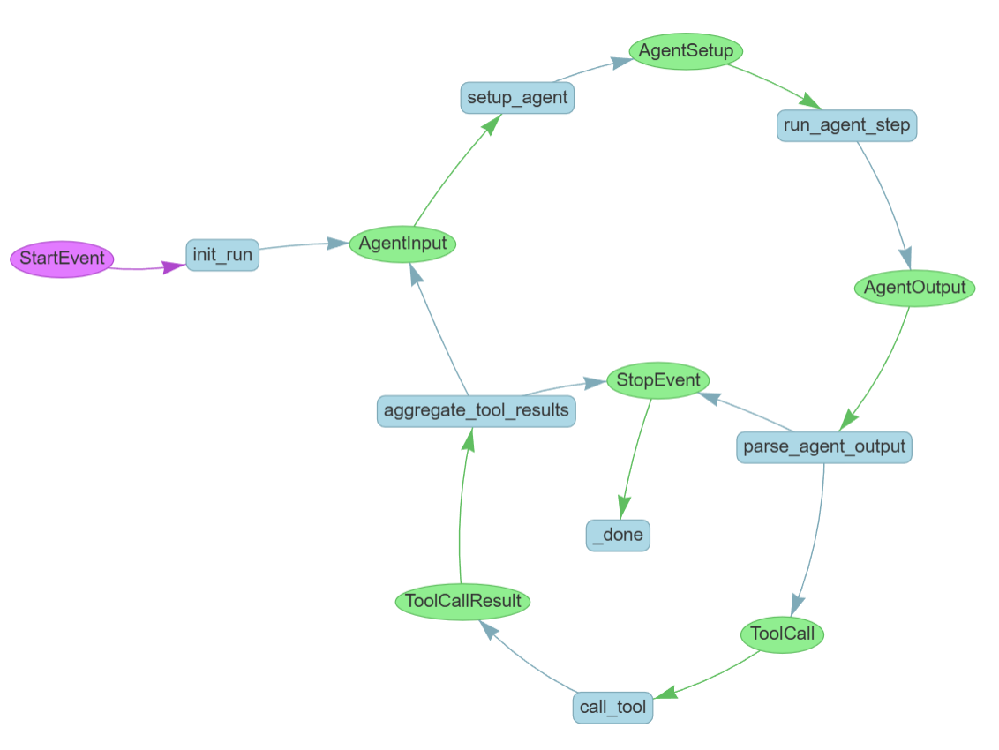

# AI-Agent-Itty
A retrieval-augmented generation (RAG) agent for cooking that leverages [llama_index](https://github.com/jerryjliu/llama_index) for indexing a collection of cookbooks, recipes, and culinary texts. It also integrates web search and external API tools to fetch the latest cooking trends, methods, and recipes on demand.

## Features

- **Document Indexing & Retrieval:**  
  Index a local collection of cooking documents (cookbooks, recipes, culinary history) using llama_index.
  
- **Web Search Integration:**  
  Retrieve up-to-date cooking content, trends, and external resources via web search.

- **API Tools (in_dev):**  
  Integrate with external APIs (e.g., recipe databases, nutritional info services) to enrich responses.

- **Retrieval Augmented Generation (RAG):**  
  Combine indexed documents with generative models to provide comprehensive and context-aware cooking advice.

## WorkFlow

A workflow diagram or state diagram illustrates the control flow of an AI agent system, showing how:

- The workflow begins with a `StartEvent` triggering `init_run`
- The agent gets set up, runs, and produces output
- Tool calls are made based on agent output
- Results from tools are aggregated and fed back to the agent
- The process continues until a `StopEvent` occurs

The following diagram was automatically generated using llama_index

```
from llama_index.core.agent.workflow import AgentWorkflow
from llama_index.core.workflow import Context
from llama_index.utils.workflow import draw_all_possible_flows

cooking_agent = AgentWorkflow.from_tools_or_functions(
    system_prompt=system_prompt,
    tools_or_functions=[search_in_cookbook, search_web],
    verbose=False,
)
ctx = Context(cooking_agent)
draw_all_possible_flows(cooking_agent)
```

<figure>
  
  <figcaption>Events (in oval shapes):
     * Purple: StartEvent
     * Green: Various state transitions like AgentInput, AgentOutput, ToolCall, etc.
     * StopEvent indicating workflow completion
  * Actions/Functions (in blue rectangles):
     * init_run
     * setup_agent
     * run_agent_step
     * parse_agent_output
     * call_tool
     * aggregate_tool_results
     * _done</figcaption>
</figure>
